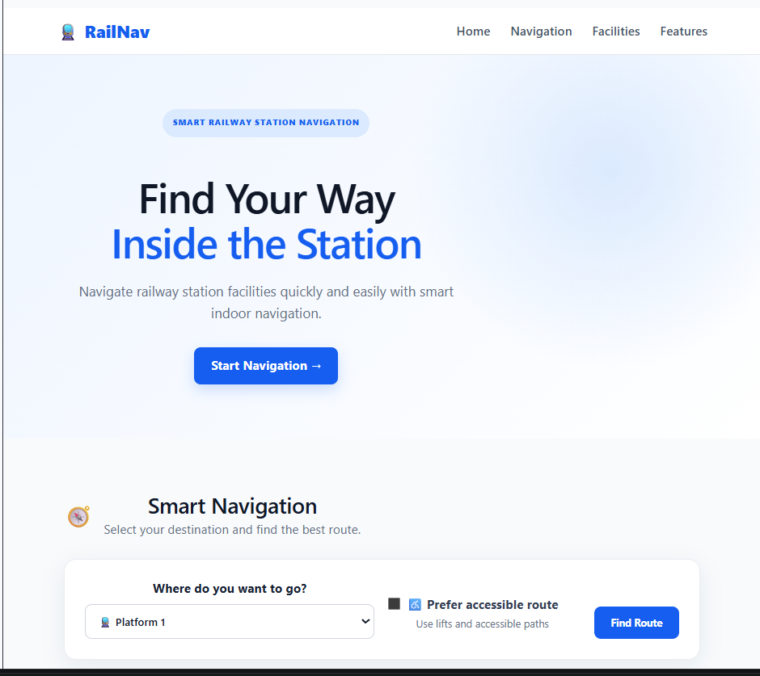
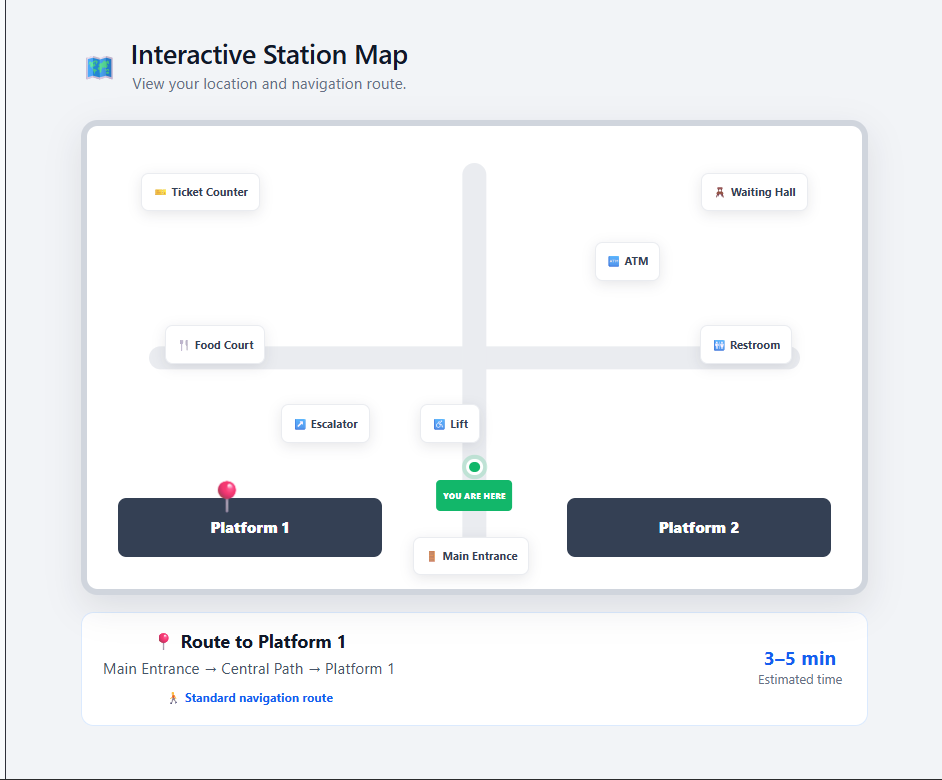
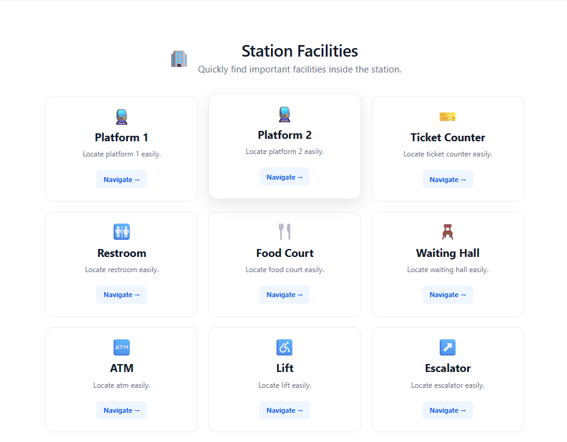
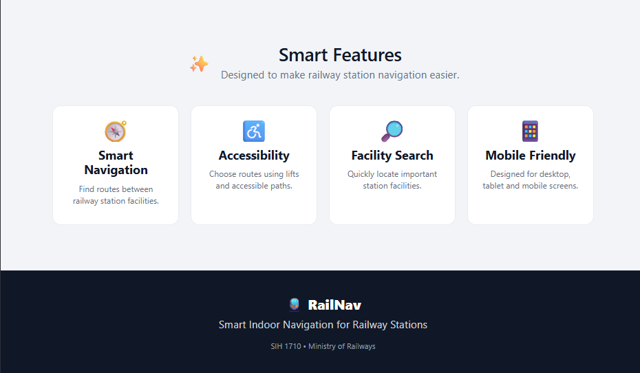

# Smart India Hackathon Workshop
# Date:17-09-2026
## Register Number:212225240011
## Name:Annapureddy kavya
## Problem Title
SIH 1710: Enhancing Navigation for Railway Station Facilities and Locations
## Problem Description
Background: Railway stations are complex environments with numerous facilities and locations such as ticket counters, platforms, restrooms, food courts, and waiting areas. Passengers often face difficulties in navigating these spaces, especially in large or unfamiliar stations. Efficient and user-friendly navigation systems are crucial for improving passenger experience, reducing congestion, and ensuring timely travel connections. Description: The problem involves developing a comprehensive navigation solution for railway stations that assists passengers in locating various facilities and destinations within the station premises. This includes creating detailed maps, providing real-time directions, and integrating features such as accessibility options for individuals with disabilities. The solution should be intuitive, easy to use, and accessible via multiple platforms, including mobile devices and digital kiosks. Key challenges include updating navigation information in real-time, ensuring accuracy, and accommodating the diverse needs of all passengers. Expected Solution: The expected solution is a multi-platform navigation system that provides detailed, real-time directions to all facilities and locations within a railway station. This system should include: A mobile application with 3D interactive maps and step-by-step navigation. Digital kiosks located throughout the station with touch-screen interfaces. Voice-guided navigation for visually impaired passengers. Regular updates to reflect changes in station layout and facility locations. Integration with existing railway apps and services for seamless user experience. The solution should enhance the overall passenger experience by reducing confusion, saving time, and improving accessibility within the station.

## Problem Creater's Organization
Ministry of Railway

## Idea
```
Interactive Railway Station Map
Provide an interactive map of the railway station showing platforms, ticket counters, restrooms, food courts, waiting halls, lifts, escalators and other important facilities.

Smart Navigation
Allow passengers to select their destination and provide the shortest or most suitable route from their current location.

Voice-Guided Navigation
Provide voice instructions to help visually impaired passengers navigate inside the railway station.

Accessibility-Based Routes
Provide accessible routes using lifts, ramps and suitable pathways for elderly passengers and persons with disabilities.

Facility Search
Users can search for facilities such as toilets, drinking water, restaurants, ticket counters, ATMs and waiting rooms.

Digital Kiosk Support
Interactive kiosks can be installed at important locations inside the station so passengers can obtain directions without installing the mobile application.

Real-Time Updates
Railway administrators can update information about platform changes, closed facilities, construction areas and temporary routes.

Railway Service Integration
The application can be integrated with existing railway services to provide relevant train, platform and station information.
```
## Proposed Solution / Architecture Diagram





## Use Cases
```
1. Find platforms and station facilities.
2. Get the best route to a selected destination.
3. Get accessible routes using lifts and accessible paths.
4. Receive voice-guided navigation.
5. Search facilities such as restrooms, ATMs and food courts.
6. Use railway station digital kiosks for navigation.
7. Receive updated station and facility information.
8. Access emergency and help locations.
```
## Technology Stack
```
Frontend: React.js, HTML, CSS, JavaScript, Vite
Mobile: Flutter
Backend: Java Spring Boot, Python FastAPI
Database: PostgreSQL
Real-time: Apache Kafka
Authentication: OAuth 2.0 / Firebase Authentication
Voice: Text-to-Speech API
Tools: VS Code, Git, GitHub, Postman
Deployment: Docker and Cloud Hosting
```

## Dependencies
```
Railway station maps and topology data
Train arrival/departure and platform information
Real-time or simulated crowd-density data
Bluetooth beacons and QR markers
Flutter
Java Spring Boot
PostgreSQL
Apache Kafka
Python FastAPI
Text-to-Speech APIs
OAuth 2.0
Git and GitHub
Docker
Cloud hosting
```
